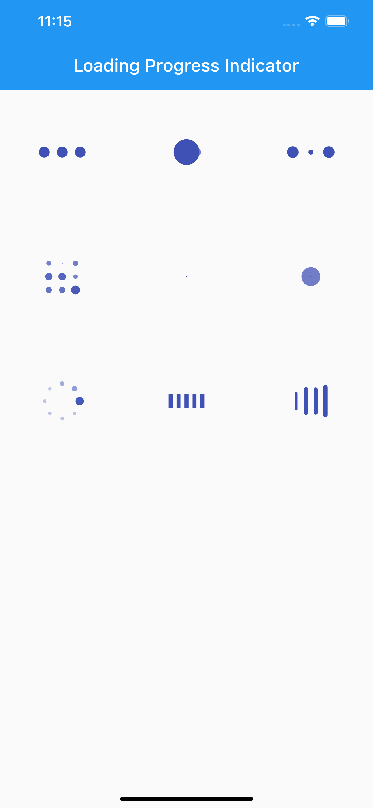

<p align="center">
<a href="https://pub.dartlang.org/packages/loading_progress_indicator">
    
</a>
<a href="https://github.com/manuelduarte077/loading_progress_indicator"></a>
<a href="https://github.com/tenhobi/effective_dart"></a>
<a href="https://opensource.org/licenses/MIT"></a>
</p>


## Features

- ✅ BallPulseProgressIndicator(),
- ✅ PacmanProgressIndicator(),
- ✅ BallBeatProgressIndicator(),
- ✅ BallGridPulseProgressIndicator(),
- ✅ BallScaleProgressIndicator(),
- ✅ BallScaleMultipleProgressIndicator(),
- ✅ BallSpinFadeLoaderProgressIndicator(),
- ✅ LineScaleProgressIndicator(),
- ✅ LineScalePartyProgressIndicator(),
- ✅ LineScalePulseOutProgressIndicator(),


## Examples
If you prefer you can download the example of the previous code from [here](https://github.com/manuelduarte077/loading_progress_indicator/blob/develop/example/lib/main.dart).

 


## Getting started

```shell 
$ flutter pub add loading_progress_indicator
```

## Usage

``` dart
  body: Center(
    child: LoadingProgressIndicator(
        indicator: BallPulseProgressIndicator(),
        size: 50,
        color: Colors.indigo,
    ),
  ); 
```